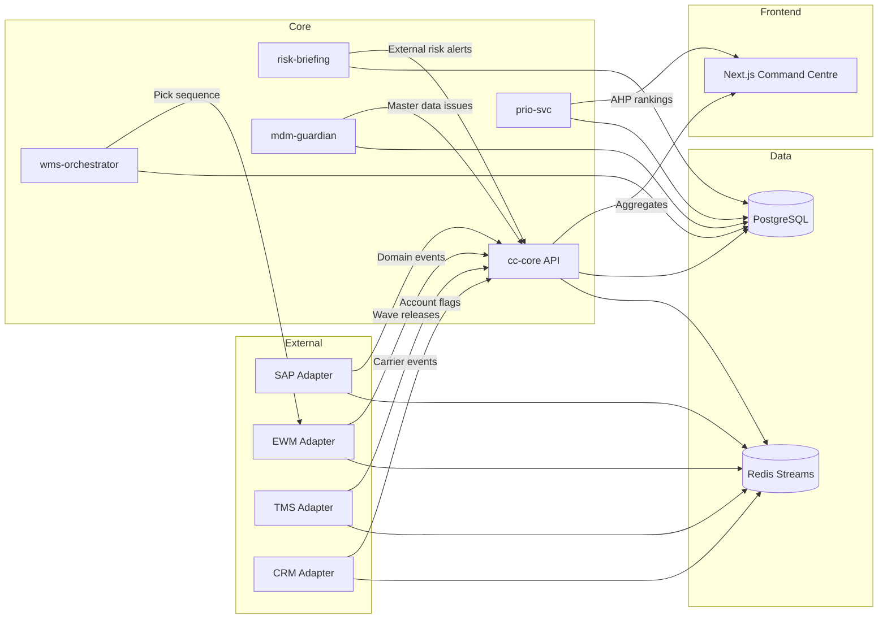

# Architecture Overview

```mermaid
flowchart LR
  subgraph External
    SAP[SAP Adapter]
    EWM[EWM Adapter]
    TMS[TMS Adapter]
    CRM[CRM Adapter]
  end
  subgraph Core
    CC[cc-core API]
    PRIO[prio-svc]
    WMS[wms-orchestrator]
    RISK[risk-briefing]
    MDM[mdm-guardian]
  end
  subgraph Data
    PG[(PostgreSQL)]
    REDIS[(Redis Streams)]
  end
  subgraph Frontend
    WEB[Next.js Command Centre]
  end

  SAP -->|Domain events| CC
  EWM -->|Wave releases| CC
  TMS -->|Carrier events| CC
  CRM -->|Account flags| CC

  CC -->|Aggregates| WEB
  PRIO -->|AHP rankings| WEB
  WMS -->|Pick sequence| EWM
  RISK -->|External risk alerts| CC
  MDM -->|Master data issues| CC

  CC --> PG
  PRIO --> PG
  WMS --> PG
  RISK --> PG
  MDM --> PG
  CC --> REDIS
  SAP --> REDIS
  EWM --> REDIS
  TMS --> REDIS
  CRM --> REDIS
```
